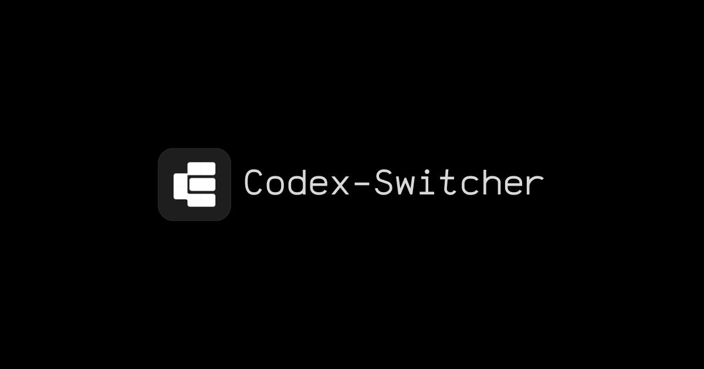

<p align="center">
  
</p>

<div align="center">

# Codex Switcher

Codex Switcher is a modern Windows desktop GUI for managing multiple Codex accounts from one place.


<p>
  
  
  
  
  
</p>

</div>

## At a glance

| Area  | What you get                                   |
| ----- | ---------------------------------------------- |
| App   | Wails-powered Windows desktop GUI              |
| Stack | Go backend, React frontend, TypeScript, Bun    |
| Modes | Native window, tray, and browser/LAN access    |
| Focus | Account switching, usage, warm-up, and backups |

## Why this exists

Codex Switcher exists for the moments where one account is not enough. It gives you a clean GUI for switching identities, checking usage, warming accounts, and keeping backups without digging through config files by hand.

## What it does

- Add and manage multiple accounts in a focused desktop interface
- Switch the active account with one click
- Monitor usage and quota status
- Warm up accounts when you want them ready
- Import and export backups
- Stay in the tray when the window closes
- Serve the UI over HTTP for browser or LAN access

## Quick start

### Download

Grab the latest release from [GitHub Releases](https://github.com/ChloeVPin/chlodex-switcher/releases/latest) and run the Windows installer or `.exe`.

### First launch

1. Open Codex Switcher.
2. Add an account from the Accounts screen.
3. Switch to the account you want active.
4. Check usage, warm up accounts, or open the tray menu as needed.

## Core workflows

### Add an account

Open the Add Account dialog, give the account a name, and connect it through the GUI flow you prefer.

### Switch accounts

Select an account and switch it from the main dashboard. The app updates the active account in the background.

### Monitor usage

Usage cards and status blocks show the current account state so you can see what is available at a glance.

### Warm up accounts

Use warm-up controls when you want to keep an account fresh and ready for use.

### Import and export backups

Backups are available from the app's backup tools and are designed to keep local account state easy to restore.

### Tray and window controls

The app stays lightweight in the system tray. Closing the window hides the app, while the tray menu gives you a clean path to show, hide, or quit.

### Browser / LAN mode

You can serve the UI over HTTP when you want browser access on the same machine or across your local network.

## Development

The project uses Wails v2, Go, React, TypeScript, and Bun.

```bash
go install github.com/wailsapp/wails/v2/cmd/wails@v2.12.0
bun install
wails doctor
wails dev
```

See [docs/development.md](docs/development.md) for the full local workflow.

## Build

```bash
wails build
```

For the Windows single-exe launcher build:

```bash
bun run build:windows
```

For browser/LAN mode:

```bash
bun run lan
```

## Windows notes

- WebView2 is required.
- CGO must be available for Wails builds.
- `wails doctor` is the fastest way to check missing prerequisites.
- Tray and window behavior are part of the desktop experience, so test those paths on Windows before shipping changes.

## Project docs

- [Architecture](docs/architecture.md)
- [Development guide](docs/development.md)
- [Release process](docs/release-process.md)
- [FAQ](docs/faq.md)
- [Contributing](CONTRIBUTING.md)

## Troubleshooting

- If the app window does not appear, install or repair WebView2.
- If a build fails on Windows, run `wails doctor` and check CGO and compiler setup.
- If LAN mode is unreachable, confirm the firewall and port settings.
- If an issue report feels vague, open the bug form in GitHub so the repro details stay structured.

## Contributing

Please see [CONTRIBUTING.md](CONTRIBUTING.md).

## License

Codex Switcher is licensed under the [MIT License](LICENSE).
